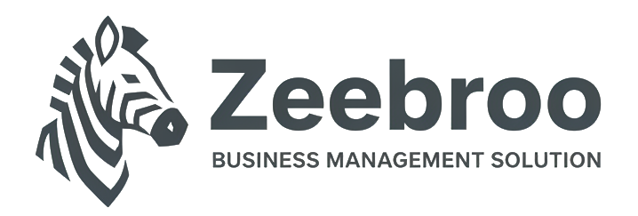

<p align="center">
  
</p>

<h1 align="center">Zeebroo</h1>

<p align="center">
  Multi-business operations platform built on <strong>Laravel</strong> with modular domains for POS, products, accounting, HR, and more.
</p>

<p align="center">
  <a href="#requirements">Requirements</a>
  ·
  <a href="#installation">Installation</a>
  ·
  <a href="#pos-desktop-git-submodule">POS desktop</a>
  ·
  <a href="#deployment">Deployment</a>
  ·
  <a href="#pos-online--desktop">POS</a>
</p>

---

## About

Zeebroo is a modular Laravel application (`nwidart/laravel-modules`) for running one or more businesses: inventory, sales, purchases, accounts, staff, file management, and point-of-sale workflows.

| Area | Module |
|------|--------|
| Authentication & permissions | `Auth` |
| Businesses & branches | `Business` |
| Products & catalog | `Product` |
| Point of sale | `Pos` |
| Sales & purchases | `Transaction`, `Purchase` |
| Accounting | `Account` |
| HR | `HRManagement` |
| Settings & theme | `Settings`, `Theme` |
| Files & AI | `FileManager`, `AIBot` |

---

## Requirements

| Tool | Version |
|------|---------|
| **PHP** | 8.4+ |
| **Composer** | 2.x |
| **Database** | MySQL / MariaDB / PostgreSQL / SQLite |
| **Node.js** | Optional — UI is maintained without a frontend build step for most changes |

For the **Qt POS desktop client**, see the [`pos-desktop`](#pos-desktop-git-submodule) git submodule (Qt 6, CMake 3.21+).

---

## Installation

### 1. Clone

```bash
git clone --recurse-submodules git@github.com:Zeebroo-Team/zeebroo-core.git zeebroo-core
cd zeebroo-core
```

HTTPS:

```bash
git clone https://github.com/Zeebroo-Team/zeebroo-core.git zeebroo-core
cd zeebroo-core
```

If you need the POS desktop sources, initialize submodules:

```bash
git submodule update --init --recursive
```

Or clone in one step:

```bash
git clone --recurse-submodules https://github.com/Zeebroo-Team/zeebroo-core.git zeebroo-core
cd zeebroo-core
```

### 2. PHP dependencies

```bash
composer install
```

### 3. Environment

```bash
cp .env.example .env
php artisan key:generate
```

Configure database, `APP_URL`, mail, and other values in `.env`.

### 4. Database

```bash
php artisan migrate
# optional:
php artisan db:seed
```

### 5. Storage link

```bash
php artisan storage:link
```

### 6. Run locally

```bash
php artisan serve
```

Open `APP_URL` in your browser and sign in with your seeded or created user.

---

## POS desktop (git submodule)

The Qt 6 terminal client is included as a **git submodule** from [Zeebroo-Team/zeebroo-pos-desktop](https://github.com/Zeebroo-Team/zeebroo-pos-desktop) at path **`pos-desktop/`**. The CMake project lives one level down: **`pos-desktop/pos-desktop/`**.

| | |
|--|--|
| **Submodule path** | `pos-desktop/` |
| **Upstream** | [github.com/Zeebroo-Team/zeebroo-pos-desktop](https://github.com/Zeebroo-Team/zeebroo-pos-desktop) |
| **Docs** | [`pos-desktop/README.md`](pos-desktop/README.md) (upstream wrapper README) |

Initialize after clone:

```bash
git submodule update --init --recursive
```

Build the app (from repo root):

```bash
cd pos-desktop/pos-desktop
cmake -B build -DCMAKE_BUILD_TYPE=Release \
  -DCMAKE_PREFIX_PATH="$(qtpaths6 --install-prefix 2>/dev/null || echo /opt/homebrew/opt/qt)"
cmake --build build
```

Bump the pinned version in Zeebroo Core:

```bash
cd pos-desktop
git fetch origin && git checkout main && git pull origin main
cd ..
git add pos-desktop
git commit -m "Bump pos-desktop submodule."
```

---

## Deployment

### Web application (Laravel)

1. **Server** — PHP 8.4+, Composer, web server (Nginx/Apache) or `php-fpm`, database, Redis optional for cache/queues.
2. **Code** — deploy the repo **with submodules**:
   ```bash
   git clone --recurse-submodules git@github.com:Zeebroo-Team/zeebroo-core.git
   cd zeebroo-core   # or your deploy path
   ```
3. **Install**
   ```bash
   composer install --no-dev --optimize-autoloader
   cp .env.example .env   # or use your secrets manager
   php artisan key:generate
   php artisan migrate --force
   php artisan storage:link
   php artisan config:cache
   php artisan route:cache
   php artisan view:cache
   ```
4. **Permissions** — `storage/` and `bootstrap/cache/` writable by the web user.
5. **Scheduler & queue** (if used):
   ```bash
   * * * * * cd /path/to/app && php artisan schedule:run >> /dev/null 2>&1
   php artisan queue:work
   ```
6. **HTTPS** — set `APP_URL` to your production URL; force TLS at the proxy.

### POS API (for web Online POS & desktop)

- Routes live under `/api/v1/pos` (Sanctum bearer tokens).
- Interactive API docs: `GET /api/v1/pos/docs`
- Markdown reference: [`Modules/Pos/docs/API.md`](Modules/Pos/docs/API.md)

Ensure `laravel/sanctum` is configured and staff can authenticate before pointing terminals at the API.

### POS desktop terminals

Deploy the **backend first**, then build and distribute the Qt client from **`pos-desktop/pos-desktop/`** (after `git submodule update --init --recursive`):

```bash
cd pos-desktop/pos-desktop
cmake -B build -DCMAKE_BUILD_TYPE=Release
cmake --build build --config Release
```

Full build, config paths, and production checklist: **[`pos-desktop/README.md`](pos-desktop/README.md#deploy)** (see upstream README).

Example terminal config (`config.json`):

```json
{
  "api_base_url": "https://your-domain.com/api/v1/pos",
  "device_name": "pos-desktop-1"
}
```

---

## POS (Online & desktop)

| Client | Where | Notes |
|--------|--------|--------|
| **Web Online POS** | `/pos/online` (session auth) | Browser terminal in the Zeebroo UI |
| **REST API** | `/api/v1/pos/*` | Same business logic; used by mobile and desktop |
| **Desktop (Qt)** | Submodule `pos-desktop/` | [zeebroo-pos-desktop](https://github.com/Zeebroo-Team/zeebroo-pos-desktop) |

---

## Development

### Code style

```bash
./vendor/bin/pint
```

### Tests

```bash
php artisan test
# or
./vendor/bin/pest
```

### Module commands

```bash
php artisan module:list
php artisan module:make ModelName ModuleName
```

### AI-assisted development (optional)

[Laravel Boost](https://laravel.com/docs/ai) can be installed for agent tooling:

```bash
composer require laravel/boost --dev
php artisan boost:install
```

---

## Project structure

```
zeebroo-core/
  app/                 Application core
  Modules/             Feature modules (Pos, Product, Business, …)
  public/
    logo.png           Brand logo (README & app assets)
  pos-desktop/         Git submodule → zeebroo-pos-desktop (Qt app in pos-desktop/pos-desktop/)
  resources/           Shared views/assets
  routes/              Web & API entry routes
```

---

## Related repositories

| Repository | Description |
|------------|-------------|
| [Zeebroo-Team/zeebroo-core](https://github.com/Zeebroo-Team/zeebroo-core) | This Laravel application (monorepo) |
| [Zeebroo-Team/zeebroo-pos-desktop](https://github.com/Zeebroo-Team/zeebroo-pos-desktop) | Qt POS desktop (submodule at `pos-desktop/`) |

---

## License

The Laravel framework components remain under the [MIT license](https://opensource.org/licenses/MIT). Application licensing is defined by the project owners.
